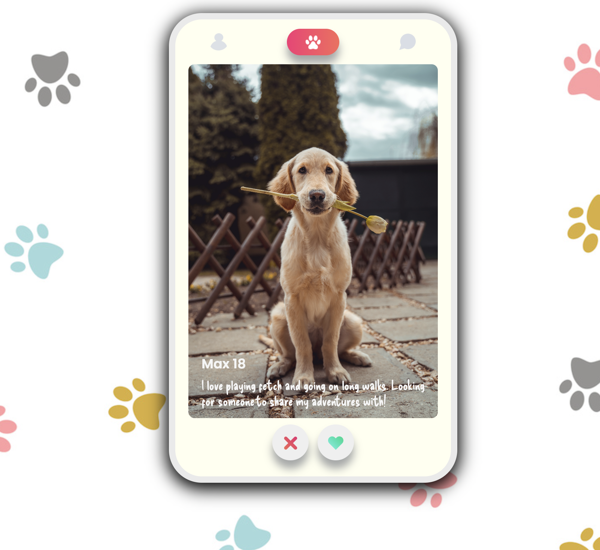

# Tindog


:rocket: **Deployed** with Netlify at https://6423fca0af4b8a7c707817a6--dog-lovers-app.netlify.app/

[](https://app.netlify.com/sites/roaring-starburst-e3170c/deploys)


## About

Dog dating app made in **vanilla javascript**. The app demonstrates my knowledge of **classes** in JS, as well as DOM manipulation, events, maps and timeouts. A user is able to like or reject a dog and see the resulting status before moving on to the next. Once the game is finished, the users liked dogs rendered from an object stored in a map.


## Wins

-[x] Responsive, using modern CSS layout tools like flexbox and CSS functions such as min().

-[x] No media queries needed to be responsive on mobile, tablet and desktop.

-[x] Dog objects are created from an array of data using classes.

-[x] Class methods used to generate html dependent on user choice.

-[x] Animation is used to show status and transitions used to provide smoother UI.


## Significant code
```javascript
// Class to create dogs with methods that set html in the game, dependent on the users input

class Dog {
	constructor(dog) {
		Object.assign(this, dog);
	}

	getDogHtml(result) {
		const { avatar, name, age, bio, hasBeenSwiped } = this;
		const status = hasBeenSwiped ? this.setLikedStatus(result) : "";

		return ` 
            <div class='profile__card'>
            
            ${status}
			<div class='card__bio'>
            	<p class='card__heading'>${name} ${age}</p>
            	<p>${bio}</p>
			</div>
            </div>
        `; 
	}

	setLikedStatus(result) {
		let status;

		if (result == true) {
			this.hasBeenLiked = true;
			status = "like-image.png";
		} else {
			this.hasBeenLiked = false;
			status = "nope-image.png";
		}

		return `
        
        `;
	}
  ```
